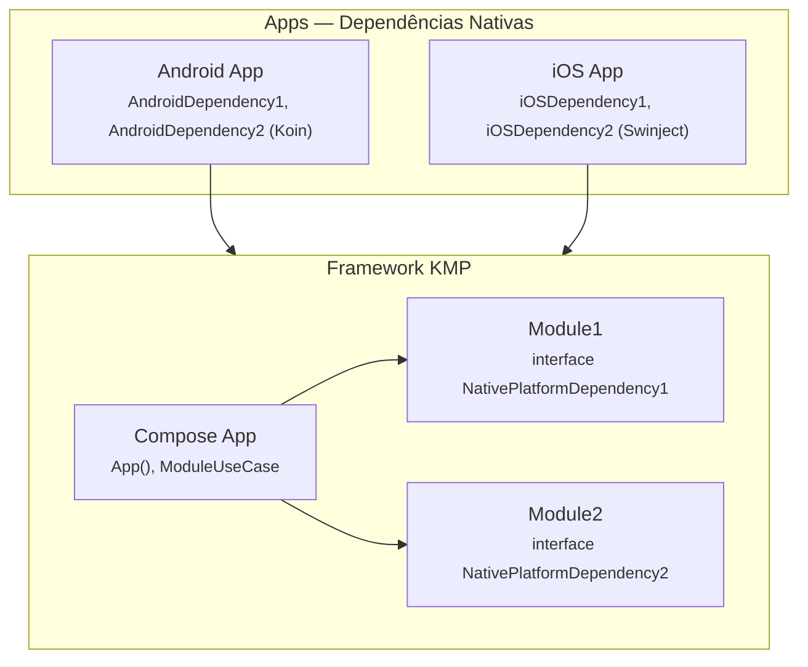
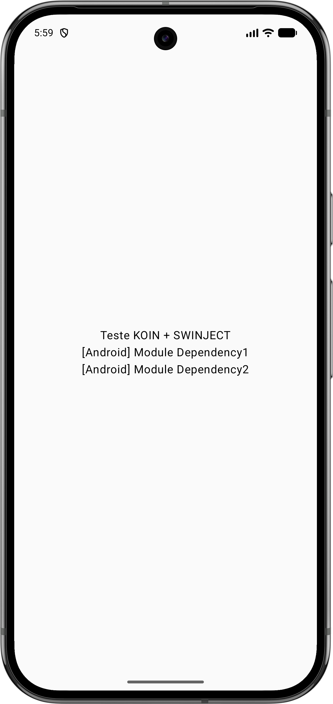
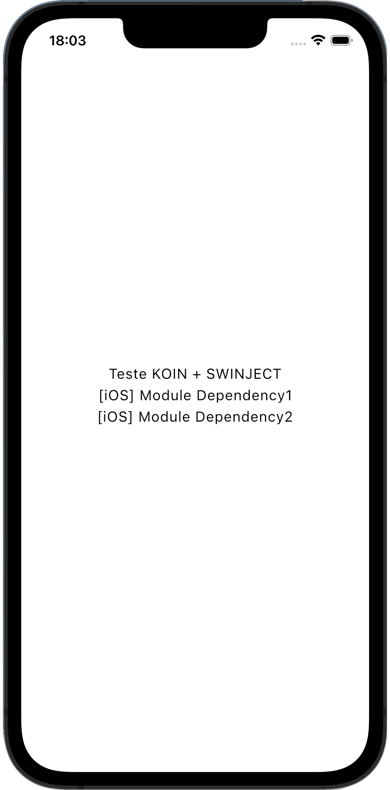

# Swinject + Koin: como injetar dependências Swift no Kotlin Multiplatform em projetos multi-módulo

**Sumário:** [Introdução](#introdução) · [Contextualização](#contextualização) · [Solução](#solução) · [Conclusão](#conclusão)

---

## Introdução

No **Kotlin Multiplatform (KMP)** a gente escreve parte do código uma vez e reutiliza no app Android e no app iOS. Às vezes essa lógica compartilhada precisa de coisas que só existem em cada plataforma — por exemplo Keychain no iOS, ou biometria em cada um. A pergunta do artigo é: como o código compartilhado recebe essas dependências se elas são criadas dentro de cada app, em Swift (iOS) ou em Kotlin (Android)?

Um exemplo ajuda. Um UseCase vive num módulo compartilhado e depende de duas interfaces; cada plataforma implementa essas interfaces do seu jeito.

```kotlin
@Factory
class ModuleUseCase(
    private val dependency1: NativePlatformDependency1,
    private val dependency2: NativePlatformDependency2,
) {
    fun doSomething1(): String = dependency1.doSomething()
    fun doSomething2(): String = dependency2.doSomething()
}
```

Esse UseCase é usado no Compose App. O Composable `App()` pede o UseCase ao Koin e exibe o resultado na tela:

```kotlin
@Composable
fun App() {
    val useCase = KoinPlatform.getKoin().get<ModuleUseCase>()

    MaterialTheme {
        Box(contentAlignment = Alignment.Center, modifier = Modifier.fillMaxSize()) {
            Column(horizontalAlignment = Alignment.CenterHorizontally) {
                Text("Teste KOIN + SWINJECT")
                Text(useCase.doSomething1())
                Text(useCase.doSomething2())
            }
        }
    }
}
```

Para isso funcionar, o Koin precisa criar o `ModuleUseCase` e injetar `NativePlatformDependency1` e `NativePlatformDependency2`. Quem fornece essas instâncias? No Android, o app; no iOS, muitas vezes um container como o **Swinject**. O problema é que o código compartilhado **não conhece** o app: em KMP a dependência flui do app para as libs, nunca o contrário. O módulo do UseCase e o Compose App ficam “embaixo” na cadeia; eles não podem importar MainActivity nem o container do iOS. Então não dá para o compartilhado “pedir” as dependências ao app; o app é que tem de **entregar** essas referências ao Koin de algum jeito. Esse é o cerne do problema.

O diagrama abaixo mostra onde cada parte fica: os apps (com as implementações), o framework KMP (interfaces, UseCase, Compose App) e a direção da dependência (app → framework).



- **Implementações:** no **Android App** (`AndroidDependency1`, `AndroidDependency2`) e no **iOS App** (`iOSDependency1`, `iOSDependency2`, registradas no Swinject).
- **Interfaces:** declaradas no **Module1** e no **Module2** (código compartilhado KMP).
- **Uso:** no **Compose App**, onde o `App()` obtém o `ModuleUseCase` via Koin; o UseCase depende das duas interfaces e precisa receber as instâncias que cada app fornecerá.

---

## Contextualização

### Implementações por plataforma

As interfaces (`NativePlatformDependency1`, `NativePlatformDependency2`) são definidas no código compartilhado. Cada plataforma implementa com suas próprias classes.

No Android, são classes Kotlin no app que implementam as interfaces expostas pelo framework KMP:

```kotlin
// Android - app
class AndroidDependency1 : NativePlatformDependency1 {
    override fun doSomething(): String = "[Android] Module Dependency1"
}

class AndroidDependency2 : NativePlatformDependency2 {
    override fun doSomething(): String = "[Android] Module Dependency2"
}
```

No iOS, são classes Swift que importam o framework Kotlin e implementam as mesmas interfaces:

```swift
// iOS - app
import IOSApp

class iOSDependency1: NativePlatformDependency1 {
    func doSomething() -> String {
        return "[iOS] Module Dependency1"
    }
}

class iOSDependency2: NativePlatformDependency2 {
    func doSomething() -> String {
        return "[iOS] Module Dependency2"
    }
}
```

### Como a DI funciona no Android e no iOS

No **Android**, o app pode usar Koin, Hilt ou outro container. O ponto de entrada (por exemplo a `MainActivity`) conhece o contexto da aplicação e pode criar ou obter as dependências (por exemplo `AndroidDependency1()`, `AndroidDependency2()`). Ou seja, o app sabe *como* fornecer as instâncias que o Koin precisará para resolver o UseCase.

No **iOS**, é comum usar um container nativo como o **Swinject**. O app cria um `Container`, registra as interfaces (incluindo as que vêm do framework Kotlin) com as implementações Swift e, quando precisa de uma instância, chama `container.resolve(Interface.self)`. No projeto, isso é feito pelo `DependencyInjector`:

```swift
enum DependencyInjector {
    static func createContainer() -> Container {
        let container = Container()
        container.register(NativePlatformDependency1.self) { _ in iOSDependency1() }
        container.register(NativePlatformDependency2.self) { _ in iOSDependency2() }
        return container
    }
}
```

O Swinject é a fonte de verdade no mundo Swift: o app conhece o container e usa ele para obter dependências. Já o **Koin** roda no código Kotlin compartilhado (dentro do framework que o app Swift importa). O Koin monta o grafo do UseCase e das demais classes do KMP, mas **não tem acesso ao container Swinject**. As instâncias que o Swinject gerencia vivem no processo do app; o Koin não sabe como obtê-las. Por isso não basta registrar tudo no Swinject — é preciso que o app **entregue** ao Koin, de alguma forma, a capacidade de obter essas instâncias quando o Koin for resolver o UseCase. 

---

## Solução

A ideia é: o módulo KMP expõe uma função que recebe “quem sabe fornecer a dependência” e **retorna** um módulo do Koin. O app chama essa função no ponto de entrada, passa a função que entrega a instância, e decide se inclui o módulo no start do Koin ou o carrega depois. A configuração do que o Koin precisa fica no próprio módulo KMP (contrato forte); o app só fornece a implementação.

### Passo 1: Interfaces no código compartilhado

As interfaces são definidas nos módulos KMP (por exemplo em `module1/dependencies/` e `module2/dependencies/`). O compartilhado conhece apenas o contrato:

```kotlin
// module1/dependencies/NativePlatformDependency1.kt
interface NativePlatformDependency1 {
    fun doSomething(): String
}

// module2/dependencies/NativePlatformDependency2.kt
interface NativePlatformDependency2 {
    fun doSomething(): String
}
```

### Passo 2: Contrato — funções que retornam o módulo

Cada feature expõe uma função que recebe uma função `Scope.() -> T` e **retorna** um `Module` do Koin. A plataforma chama `featureXModule(dependencyX = { ... })`, obtém o módulo e decide como registrá-lo.

```kotlin
// module1
fun feature1Module(dependency1: Scope.() -> NativePlatformDependency1): Module = module {
    factory<NativePlatformDependency1> { dependency1() }
}

// module2
fun feature2Module(dependency2: Scope.() -> NativePlatformDependency2): Module = module {
    factory<NativePlatformDependency2> { dependency2() }
}
```

No Android, a função passada retorna a instância diretamente (ex.: `{ AndroidDependency1() }`). No iOS, a função captura o container Swinject e resolve na hora (ex.: `{ _ in container.resolve(NativePlatformDependency1.self)! }`). O contrato é type-safe: o módulo declara o tipo esperado e o compilador exige que as plataformas passem funções compatíveis.

### Passo 3: AppModule e initKoin

O `AppModule` é a “raiz” do grafo do Koin: e declara os módulos (incluindo `ComposeModule`, que escaneia o pacote do `ModuleUseCase`). A inicialização do Koin é feita em cada plataforma chamando `initKoin(declarations)` no ponto de entrada:

```kotlin
@KoinApplication(
    modules = [
        KoinModule1::class,
        KoinModule2::class,
        ComposeModule::class
    ]
)
class AppModule

@Module
@ComponentScan("com.example.mykoincmpapplication")
class ComposeModule

fun initKoin(declarations: KoinAppDeclaration) {
    startKoin<AppModule>(declarations)
}
```

Os módulos Koin (`KoinModule1`, `KoinModule2`, `ComposeModule`) fazem apenas `@ComponentScan`; o `ComposeModule` escaneia o pacote onde está o `ModuleUseCase`; as dependências nativas vêm dos módulos retornados por `feature1Module` e `feature2Module`, que o app pode incluir no `initKoin` ou carregar depois:

```kotlin
@Module
@ComponentScan("com.example.module1")
class KoinModule1

@Module
@ComponentScan("com.example.module2")
class KoinModule2
```

### Duas estratégias para registrar os módulos de feature

O módulo retornado por `featureXModule(...)` pode ser usado de duas formas.

**Estratégia 1 — Módulo no start do Koin**

O app inclui o módulo **diretamente** no bloco `initKoin`. No Android usa-se `modules(feature1Module(...))`; no iOS, a extensão `KoinApplication.loadModule(module)` dentro do bloco de declaração passado ao `initKoin`. O grafo do Koin já nasce com as dependências nativas daquele feature.

Exemplo Android:

```kotlin
// MainActivity.onCreate
initKoin {
    modules(
        feature1Module(dependency1 = { AndroidDependency1() })
    )
}
setContent { App() }
```

Exemplo iOS:

```swift
// iOSApp init
let container = DependencyInjector.createContainer()
AppModuleKt.doInitKoin { appKoin in
    appKoin.modules(
        module: Module1ContractKt.feature1Module(dependency1: { _ in container.resolve(NativePlatformDependency1.self)! })
    )
}
```

**Estratégia 2 — Carregamento tardio**

Depois de `initKoin` ter sido chamado, o app chama `loadKoinModules(module)` (no iOS, `KoinExtensionsKt.loadKoinModules(module: ...)`). O módulo é **adicionado** ao container já em execução. Útil quando o módulo depende de algo que só existe após o `initKoin` ou quando se quer carregar features sob demanda.

Exemplo Android:

```kotlin
initKoin { }
loadKoinModules(feature2Module(dependency2 = { AndroidDependency2() }))
setContent { App() }
```

Exemplo iOS:

```swift
KoinExtensionsKt.loadKoinModules(
    module: Module2ContractKt.feature2Module(dependency2: { _ in container.resolve(NativePlatformDependency2.self)! })
)
```

O projeto inclui helpers para as duas formas (em `composeApp`, visível no iOS via `KoinExtensionsKt`):

```kotlin
// composeApp - KoinExtensions.kt
fun loadKoinModules(module: Module) {
    org.koin.core.context.loadKoinModules(module)
}

fun KoinApplication.modules(module: Module) {
    modules(module)
}
```

### Motivo de usar contratos e manter a configuração no KMP

Usar **contratos** (`feature1Module`, `feature2Module`) em vez de registrar definições soltas no app mantém o **contrato forte**: o módulo compartilhado declara explicitamente o que precisa (uma função que retorna `NativePlatformDependencyX`). Se alguém adicionar ou alterar uma dependência no módulo, a assinatura da função de contrato muda e o compilador obriga o app (Android e iOS) a atualizar as chamadas. Assim as plataformas permanecem alinhadas em tempo de build, sem falhas em runtime por dependência faltando.

Manter a **configuração das dependências nativas dentro dos módulos KMP** (cada módulo expõe seu `featureXModule` e define o `factory` no Koin) evita que o app tenha de “adivinhar” o que registrar: o módulo diz o que precisa e o app apenas passa a função que fornece a instância. O Koin fica como única fonte de verdade no mundo Kotlin; no iOS, o Swinject permanece como fonte de verdade no mundo Swift, e a ponte entre os dois é feita pelas funções passadas nos contratos.

### Cadeia completa: Composable → UseCase → dependências

O `App()` assume que o Koin já foi inicializado e os módulos carregados. Apenas obtém o UseCase e exibe o resultado:

```kotlin
@Composable
fun App() {
    val useCase = KoinPlatform.getKoin().get<ModuleUseCase>()

    MaterialTheme {
        Box(contentAlignment = Alignment.Center, modifier = Modifier.fillMaxSize()) {
            Column(horizontalAlignment = Alignment.CenterHorizontally) {
                Text("Teste KOIN + SWINJECT")
                Text(useCase.doSomething1())
                Text(useCase.doSomething2())
            }
        }
    }
}
```

Fluxo: na plataforma, `initKoin` (e, se usar carregamento tardio, `loadKoinModules`). No Composable, `get<ModuleUseCase>()` → o Koin resolve o UseCase, invoca as funções registradas nos módulos para obter as dependências nativas e injeta → resultado na tela.

---

## Conclusão

**Benefícios e trade-offs**

A abordagem permite injetar dependências nativas no KMP sem violar a direção da dependência entre app e lib. A plataforma passa funções no ponto de entrada; o Koin usa os módulos retornados por `featureXModule(...)` para registrar os factories. No iOS, o Swinject continua como fonte de verdade e o Koin apenas invoca as funções que fazem `resolve` no container; assim como o Android que pode usar o Hilt (ou o proprio Koin) como fonte da verdade. O contrato forte garante que mudanças nas dependências quebrem o build nas plataformas que não atualizarem as chamadas. O padrão escala para vários módulos e é testável.

Por outro lado, a ordem de inicialização é crítica: se a UI for exibida antes de `initKoin` e dos módulos de feature estarem registrados, a resolução falhará. É importante garantir que todos os `featureXModule` usados estejam no container (via `initKoin` ou `loadKoinModules`) antes de exibir o Compose. Um módulo pode depender de outro para o tipo da função (por exemplo module1 usar um tipo definido em module2).

Outros autores propuseram estratégias mais simples, por exemplo um único módulo de plataforma ou um único ponto de “setup” com expect/actual. Essas abordagens funcionam bem quando há poucas dependências nativas ou um único bloco de código específico por plataforma. A estratégia descrita aqui — múltiplos módulos, cada um com seu contrato que retorna um `Module`, e a possibilidade de incluir no start do Koin ou de carregar tardiamente — consegue ir além: escala para muitos features, preserva o DI nativo (Swinject) no iOS, mantém o contrato forte por módulo e permite flexibilidade de carregamento conforme a necessidade do app.

<div style="display: flex; justify-content: space-evenly; align-items: center; flex-wrap: wrap; width: 100%;">
  
  
</div>

### Referências

- [How to use Swift packages in Kotlin Multiplatform using Koin](https://proandroiddev.com/how-to-use-swift-packages-in-kotlin-multiplatform-using-koin-c7d24fdbbbd7) (ProAndroidDev)
- [KMP Advanced Patterns \| Koin](https://insert-koin.io/docs/reference/koin-mp/kmp/) (insert-koin.io)
- [KMP: Injecting Swift classes via Koin](https://medium.com/codandotv/kmp-injecting-swift-classes-via-koin-8bb9c7d7859f) (Medium / Coda no TV)
- [Injeção de dependências com Koin no Kotlin Multiplatform (KMP)](https://medium.com/fretebras-tech/inje%C3%A7%C3%A3o-de-depend%C3%AAncias-com-koin-no-kotlin-multiplatform-kmp-d3eda45249e6) (Medium / Fretebras Tech)
