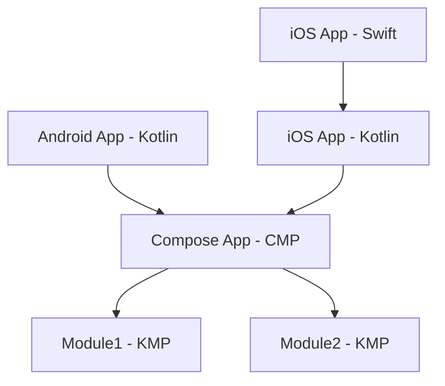

# Swinject + Koin: como injetar dependências Swift no Kotlin Multiplatform em projetos multi-módulo

O Kotlin Multiplatform (KMP) permite compartilhar lógica de negócio entre Android e iOS. Quando essa lógica precisa consumir dependências que só existem no mundo nativo — criptografia, Keychain, biometria, SDKs proprietários — o cenário fica mais complexo.

No iOS, essas implementações vivem em Swift e costumam estar em um container de DI como o **Swinject**. No Android, o equivalente pode ser Hilt ou Koin. A pergunta central: como fazer um `UseCase` no `commonMain` receber essas instâncias nativas?

```kotlin
@Factory
class ModuleUseCase(
    private val dependency1: NativePlatformDependency1,
    private val dependency2: NativePlatformDependency2,
) {
    fun doSomething1(): String = dependency1.doSomething()
    fun doSomething2(): String = dependency2.doSomething()
}
```

O UseCase vive no código compartilhado e depende de duas interfaces. As implementações concretas vêm de cada plataforma. O desafio é fazer essas instâncias chegarem até aqui.

---

## Como Swinject e Koin funcionam neste projeto

Antes de entrar na solução, vale deixar claro o papel de cada container no projeto.

**Swinject (iOS)** — No app iOS, o Swinject é o container de injeção de dependências. O app cria um `Container`, registra interfaces (por exemplo as expostas pelo framework Kotlin) associadas a implementações Swift e, quando precisa de uma instância, chama `container.resolve(Interface.self)`. Tudo que é específico do iOS — Keychain, biometria, SDKs nativos — pode ser registrado ali. O Swinject é a **fonte de verdade** no mundo Swift: quem vive no app conhece o container e usa ele para obter dependências.

No projeto, o `DependencyInjector` configura o container e registra as interfaces (expostas pelo framework Kotlin) com as implementações Swift:

```swift
enum DependencyInjector {
    static func createContainer() -> Container {
        let container = Container()
        container.register(NativePlatformDependency1.self) { _ in iOSDependency1() }
        container.register(NativePlatformDependency2.self) { _ in iOSDependency2() }
        return container
    }
}
```

Quando o Koin precisar de uma instância no iOS, o app passa funções que capturam esse `container` e chamam `container.resolve(...)` na hora da resolução. O Swinject permanece como fonte de verdade; o Koin apenas invoca essas funções.

**Koin (KMP)** — No código compartilhado (Kotlin), o Koin é o container usado para montar o grafo de dependências. O app chama `initKoin { }` no ponto de entrada e, em seguida, carrega módulos que declaram factories e singletons. O `ModuleUseCase` e outros tipos do KMP são resolvidos pelo Koin: quando alguém pede `get<ModuleUseCase>()`, o Koin cria o UseCase e injeta o que ele precisa (por exemplo `NativePlatformDependency1` e `NativePlatformDependency2`). Ou seja, o Koin é a **fonte de verdade** no mundo Kotlin compartilhado.

No projeto, o `AppModule` é a raiz do grafo e declara os módulos compartilhados. A inicialização é feita no app via `initKoin(declarations)`:

```kotlin
@KoinApplication(modules = [KoinModule1::class, KoinModule2::class])
@ComponentScan("com.example.mykoincmpapplication")
class AppModule

fun initKoin(declarations: KoinAppDeclaration) {
    startKoin<AppModule>(declarations)
}
```

Os módulos Koin (`KoinModule1`, `KoinModule2`) fazem apenas `@ComponentScan`; as dependências nativas não vêm daqui — são registradas depois pelas chamadas `startModule1` / `startModule2` (que usam `loadKoinModules`). O `initKoin` é chamado **uma vez** no ponto de entrada (MainActivity, iOS init), antes de qualquer `startModuleN` e antes do `App()`.

```kotlin
@Module
@ComponentScan("com.example.module1")
class KoinModule1

@Module
@ComponentScan("com.example.module2")
class KoinModule2
```

**O que falta** — O Swinject sabe criar as implementações iOS das interfaces que o KMP conhece; o Koin sabe criar o UseCase desde que alguém tenha registrado as dependências nativas. O problema é que os dois mundos não se falam: o Koin roda dentro do framework que o app Swift importa e **não tem acesso ao container Swinject**. Por isso não basta registrar tudo no Swinject: é preciso que o app **entregue** ao Koin, de alguma forma, as instâncias (ou a capacidade de obtê-las) que o Swinject gerencia. As seções a seguir mostram por que isso é não trivial e como fazer essa ponte.

---

**Sumário:** [Como Swinject e Koin funcionam](#como-swinject-e-koin-funcionam-neste-projeto) · [Swinject e o desafio no iOS](#swinject-e-o-desafio-no-ios) · [Por que não é trivial](#por-que-não-é-trivial-direção-da-dependência) · [Visão geral](#visão-geral-da-solução) · [Implementação](#implementação) · [Benefícios e trade-offs](#benefícios-e-trade-offs) · [Conclusão](#conclusão)

---

## Swinject e o desafio no iOS

No iOS, as dependências nativas ficam no Swinject: o app registra interfaces com implementações Swift e pede ao container quando precisa de uma instância. O **KMP não tem acesso a esse container**. O código Kotlin roda dentro do framework que o app importa; o Koin que monta o grafo no KMP não sabe como obter o que o Swinject gerencia. Ou seja: é preciso **entregar** essas referências ao mundo Kotlin. A solução adotada é o app passar, no ponto de entrada, funções que o Koin invocará na resolução; no iOS, cada função usa o container para fazer `resolve` e devolver a instância ao Koin. O Swinject continua como fonte de verdade; o KMP recebe as instâncias sem conhecer o container.

---

## Por que não é trivial: direção da dependência

O código compartilhado **não enxerga o código nativo** — e nem deveria. Em KMP, a dependência flui do app para as libs, nunca o contrário:



O app iOS importa o framework Kotlin; o framework depende do Compose App e dos módulos (module1, module2). Os módulos compartilhados ficam na base — sem referência ao app. Inverter essa seta criaria dependência circular. Um feature module KMP **nunca** referencia classes do app.

---

## Visão geral da solução

A resposta combina **lambdas** e **Koin**. O código compartilhado expõe funções `startModule1(dependency1)` e `startModule2(dependency2)` que recebem uma função `Scope.() -> T`. O app passa essa função no ponto de entrada; ela é usada em `loadKoinModules` para registrar um `factory` no Koin. Quando o UseCase for resolvido, o Koin invoca a função (no Android retorna a instância Kotlin; no iOS, a função resolve no Swinject) e injeta o resultado.

**Fluxo em três passos:**

1. **Plataforma** — O app chama `initKoin { }` e em seguida `startModule1(dependency1 = { Dependency1() })` e `startModule2(dependency2 = { Dependency2() })` (Android) ou, no iOS, funções que resolvem no container Swinject. As funções são usadas apenas para registrar as definições no Koin.

2. **KMP** — Cada `startModuleN` chama `loadKoinModules(module { factory<T> { ... } })`, registrando a dependência nativa no container já inicializado. Os módulos Koin (`KoinModule1`, `KoinModule2`) fazem apenas `@ComponentScan`; as dependências nativas vêm dessas definições dinâmicas. O UseCase (`@Factory`) passa a ser resolvível.

3. **Composable** — O `App()` obtém o `ModuleUseCase` via `get<>()`. O Koin resolve o UseCase e, ao injetar as dependências, invoca as funções registradas e retorna a instância.

**Ordem crítica:** `initKoin` → `startModule2` / `startModule1` → `App()`. O Koin deve estar inicializado e os módulos carregados antes de exibir a UI.

---

## Implementação

### 1. Interfaces no `commonMain`

As interfaces são definidas no módulo compartilhado. O KMP conhece apenas o contrato:

```kotlin
interface NativePlatformDependency1 {
    fun doSomething(): String
}

interface NativePlatformDependency2 {
    fun doSomething(): String
}
```

### 2. Implementações por plataforma

Cada app implementa as interfaces com suas próprias classes. No Android, são classes Kotlin. No iOS, são classes Swift que importam o framework Kotlin:

```kotlin
// Android
class Dependency1 : NativePlatformDependency1 {
    override fun doSomething(): String = "[Android] Module1 Dependency1"
}
```

```swift
// iOS
import IOSApp

class iOSDependency1: NativePlatformDependency1 {
    func doSomething() -> String {
        return "[iOS] Module1 Dependency1"
    }
}
```

### 3. Contrato: funções que fornecem a dependência

Cada módulo expõe uma função que recebe outra função com tipo `Scope.() -> T`. Essa função é invocada pelo Koin no momento da resolução. A plataforma passa essa função no ponto de entrada; o Koin usa ela para obter a instância e registrá-la como factory.

```kotlin
// module2
fun startModule2(dependency2: Scope.() -> NativePlatformDependency2) {
    loadKoinModules(
        module {
            factory<NativePlatformDependency2> { dependency2() }
        }
    )
}
```

- **Android** — A função retorna a instância Kotlin diretamente, ex.: `{ Dependency2() }`.
- **iOS** — A função captura o container Swinject e resolve na hora: `{ _ in container.resolve(NativePlatformDependency2.self)! }`.

O contrato continua type-safe: o módulo declara que precisa de uma função que retorna `NativePlatformDependencyX`. Quem chama `startModuleN` deve passar uma função compatível; o compilador garante o alinhamento entre plataformas.

### 4. Registro das dependências: `startModule1` e `startModule2`

Cada módulo expõe uma função que recebe a função que fornece a dependência e chama `loadKoinModules` para registrar um `factory` no Koin já inicializado.

```kotlin
// module1
fun startModule1(dependency1: Scope.() -> NativePlatformDependency1) {
    loadKoinModules(
        module {
            factory<NativePlatformDependency1> { dependency1() }
        }
    )
}
```

No Android seria possível registrar as dependências nativas diretamente dentro do bloco `initKoin { }` (por exemplo com `loadKoinModules(module { factory { Dependency1() } })`). Chamar os métodos de contrato (`startModule1`, `startModule2`) é mais interessante porque **mantém o contrato forte**: o módulo compartilhado declara explicitamente o que precisa, e qualquer mudança nas dependências exige que o app atualize as chamadas — o compilador aponta onde ajustar. Assim as plataformas permanecem alinhadas em tempo de build.

O app chama `initKoin` e em seguida os `startModuleN` com as funções, **antes** de exibir a UI:

```kotlin
// Android - MainActivity.onCreate
initKoin { }

startModule2(dependency2 = { Dependency2() })
startModule1(dependency1 = { Dependency1() })

setContent { App() }
```

```swift
// iOS - init do app
init() {
    let container = DependencyInjector.createContainer()

    AppModuleKt.doInitKoin { _ in }

    Module1ContractKt.startModule1(dependency1: { _ in container.resolve(NativePlatformDependency1.self)! })
    Module2ContractKt.startModule2(dependency2: { _ in container.resolve(NativePlatformDependency2.self)! })
}
```

### 5. Cadeia completa: Composable → UseCase → dependências

O `App()` assume que o Koin já foi inicializado e os módulos carregados. Apenas obtém o UseCase e exibe o resultado:

```kotlin
@Composable
fun App() {
    val useCase = KoinPlatform.getKoin().get<ModuleUseCase>()

    MaterialTheme {
        Box(contentAlignment = Alignment.Center, modifier = Modifier.fillMaxSize()) {
            Column(horizontalAlignment = Alignment.CenterHorizontally) {
                Text("Teste KOIN + SWINJECT")
                Text(useCase.doSomething1())
                Text(useCase.doSomething2())
            }
        }
    }
}
```

**Fluxo:** Na plataforma: `initKoin` → `startModule2` / `startModule1` (funções registradas no Koin). No Composable: `get<ModuleUseCase>()` → Koin resolve o UseCase, invoca as funções para obter as dependências nativas e injeta → resultado na tela.

---

## Benefícios e trade-offs

### Pontos fortes

| Aspecto | Descrição |
|---------|-----------|
| **Sem estado global** | A plataforma passa funções no ponto de entrada e o Koin usa `loadKoinModules` para registrar os factories. Nada fica armazenado em singleton. |
| **Swinject preservado** | No iOS, o Koin não substitui o DI nativo. O Swinject continua como fonte de verdade; as funções capturam o container e chamam `resolve` quando o Koin precisa da instância. |
| **Contrato forte** | Chamar `startModule1` e `startModule2` (em vez de registrar tudo dentro de `initKoin`) faz o módulo declarar o que precisa. Mudanças quebram o build nas plataformas que não atualizarem as chamadas. |
| **Escalável** | Vários módulos seguem o mesmo padrão: `startModule1`, `startModule2`, etc. O app chama todos em sequência após `initKoin`. |
| **Testável** | Em testes, basta chamar `startModule1 { fakeDependency1 }` (e equivalentes) antes de resolver o UseCase. |
| **Inicialização explícita** | O Koin é inicializado uma vez no ponto de entrada (`initKoin`), e os módulos são carregados em seguida. O `App()` não chama `startKoin`, evitando dúvidas com recomposição. |

### Pontos fracos e mitigações

| Trade-off | Impacto | Mitigação |
|-----------|---------|-----------|
| **Ordem crítica** | Se a UI for exibida antes de `initKoin` e dos `startModuleN`, a resolução falhará. | Documentar a ordem no ponto de entrada (initKoin → startModule2 / startModule1 → setContent / ContentView). Manter um único lugar de bootstrap por plataforma. |
| **Dependência entre módulos** | Um módulo pode depender de outro para o tipo da função (ex.: module1 usar em `startModule1` um tipo definido em module2). | Documentar a dependência entre módulos. |
| **Funções no iOS** | A sintaxe em Swift para as funções Kotlin pode ser menos óbvia (`{ _ in container.resolve(...)! }`). | Documentar no README ou em comentários no init do app iOS o papel de cada chamada. |

### Quando faz sentido

Adequada quando já existe DI nativo (Swinject, Hilt) e se quer integrar KMP sem reescrever tudo.

---

## Conclusão

O uso de **funções** `Scope.() -> T` com `loadKoinModules` permite injetar dependências nativas no KMP sem violar a direção da dependência entre app e lib. O app chama `initKoin` e em seguida os `startModuleN` com as funções que fornecem as instâncias; o Koin registra esses factories e resolve as dependências quando o UseCase for criado. Chamar os métodos de contrato mantém o contrato forte em todas as plataformas. O padrão escala para múltiplos módulos (module1, module2, …); a ordem de inicialização (`initKoin` → `startModule2` / `startModule1` → `App()`) deve ser respeitada. Em apps com DI nativo já estabelecido (Swinject no iOS, Hilt no Android), essa abordagem integra o Koin ao ecossistema existente sem reescrever o grafo nativo.
