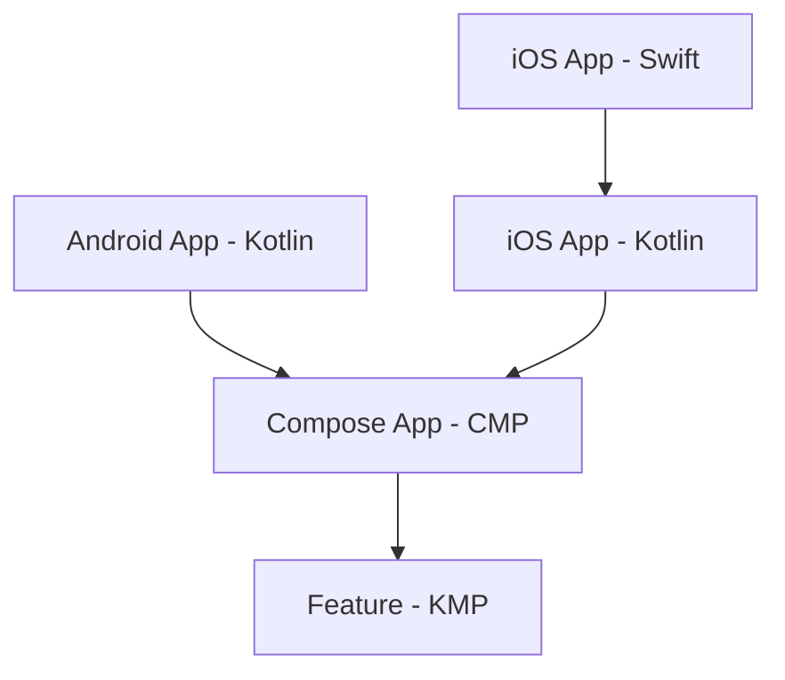
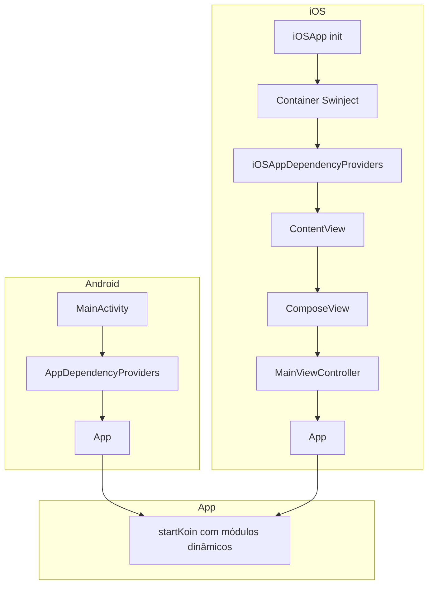

# Swinject + Koin: como injetar dependências Swift no Kotlin Multiplatform em projetos multi-módulo

O Kotlin Multiplatform (KMP) permite compartilhar lógica de negócio entre Android e iOS. Quando essa lógica precisa consumir dependências que só existem no mundo nativo — criptografia, Keychain, biometria, SDKs proprietários — o cenário fica mais complexo.

No iOS, essas implementações vivem em Swift e costumam estar em um container de DI como o **Swinject**. No Android, o equivalente pode ser Hilt ou Koin. A pergunta central: como fazer um `UseCase` no `commonMain` receber essas instâncias nativas?

```kotlin
@Factory
class ModuleUseCase(
    private val dependency1: NativePlatformDependency1,
    private val dependency2: NativePlatformDependency2,
) {
    fun doSomething1(): String = dependency1.doSomething()
    fun doSomething2(): String = dependency2.doSomething()
}
```

O UseCase vive no código compartilhado e depende de duas interfaces. As implementações concretas vêm de cada plataforma. O desafio é fazer essas instâncias chegarem até aqui.

**Sumário:** [Por que não é trivial](#por-que-não-é-trivial-direção-da-dependência) · [Visão geral](#visão-geral-da-solução) · [Implementação](#implementação) · [Benefícios e trade-offs](#benefícios-e-trade-offs) · [Conclusão](#conclusão) · [Anexo: Composition Root](#anexo-proposta-de-implementação-com-composition-root-sem-wrapper)

---

## Por que não é trivial: direção da dependência

O código compartilhado **não enxerga o código nativo** — e nem deveria. Em KMP, a dependência flui do app para as libs, nunca o contrário:



O app iOS importa o framework Kotlin; o framework depende do Compose App e dos módulos. Os módulos compartilhados ficam na base — sem referência ao app. Inverter essa seta criaria dependência circular. Um feature module KMP **nunca** referencia classes do app.

---

## Visão geral da solução

A resposta combina **Provider Pattern** e **Koin**. O código compartilhado não conhece o app; por isso o app passa o provider em tempo de execução via `startModule1(provider)`. Um wrapper singleton armazena a referência. O Koin, ao montar o grafo, usa o provider para obter e registrar as instâncias nativas.

**Fluxo em três passos:**

1. **Plataforma** — O app chama `startModule1(provider)` antes da UI. O provider implementa a interface Kotlin e retorna as instâncias nativas (no iOS, delega ao Swinject; no Android, retorna classes Kotlin). O wrapper armazena o provider.

2. **KMP** — O `startKoin<AppModule>()` (dentro de `App()`) inicializa o container. O módulo Koin lê o provider do wrapper, chama os métodos correspondentes e registra as dependências no grafo. O UseCase (`@Factory`) passa a ser resolvível.

3. **Composable** — O `App()` obtém o `ModuleUseCase` via `get<>()`. O Koin injeta as dependências (vindas do provider) e retorna a instância.

**Ordem crítica:** `startModule1` → `startKoin` → `App()`. Se o Koin subir antes do provider, a resolução falhará.

---

## Implementação

### 1. Interfaces no `commonMain`

As interfaces são definidas no módulo compartilhado. O KMP conhece apenas o contrato:

```kotlin
interface NativePlatformDependency1 {
    fun doSomething(): String
}

interface NativePlatformDependency2 {
    fun doSomething(): String
}
```

### 2. Implementações por plataforma

Cada app implementa as interfaces com suas próprias classes. No Android, são classes Kotlin. No iOS, são classes Swift que importam o framework Kotlin:

```kotlin
// Android
class Dependency1 : NativePlatformDependency1 {
    override fun doSomething(): String = "[Android] Module1 Dependency1"
}
```

```swift
// iOS
import IOSApp

class iOSDependency1: NativePlatformDependency1 {
    func doSomething() -> String {
        return "[iOS] Module1 Dependency1"
    }
}
```

### 3. O Provider: ponte entre nativo e KMP

O `Module1DependencyProvider` é uma interface que cada plataforma implementa. Ela retorna as instâncias das dependências nativas:

```kotlin
interface Module1DependencyProvider {
    fun provideDependency1(): NativePlatformDependency1
    fun provideDependency2(): NativePlatformDependency2
}
```

- **Android** — Implementação Kotlin retorna as classes locais.
- **iOS** — Implementação Swift delega ao container Swinject (ver próximo tópico).

O provider é o **elo forte** entre KMP e nativo: qualquer nova dependência no módulo compartilhado altera a interface. O código nativo deixa de compilar até implementar. O contrato explícito garante que, em tempo de **build**, todas as plataformas estejam alinhadas — sem falhas em runtime.

### 4. Swinject no iOS

No iOS, o **Swinject** é o container de DI nativo. O `DependencyInjector` configura o container e registra as interfaces (expostas pelo framework Kotlin) com as implementações Swift:

```swift
enum DependencyInjector {
    static func createContainer() -> Container {
        let container = Container()
        container.register(NativePlatformDependency1.self) { _ in iOSDependency1() }
        container.register(NativePlatformDependency2.self) { _ in iOSDependency2() }
        return container
    }
}
```

O `iOSProviderImpl` implementa `Module1DependencyProvider` e usa o container para resolver as dependências quando o Koin pedir:

```swift
class iOSProviderImpl: Module1DependencyProvider {
    private let container: Container

    init(container: Container) { self.container = container }

    func provideDependency1() -> NativePlatformDependency1 {
        return container.resolve(NativePlatformDependency1.self)!
    }
    func provideDependency2() -> NativePlatformDependency2 {
        return container.resolve(NativePlatformDependency2.self)!
    }
}
```

O Swinject permanece como fonte de verdade no iOS; o Koin apenas consome as instâncias via provider.

### 5. Wrapper e `startModule1`

O módulo compartilhado não conhece o app. Para receber o provider, usamos um wrapper singleton e uma função pública:

```kotlin
internal object Module1DependencyProviderWrapper {
    lateinit var provider: Module1DependencyProvider
}

fun startModule1(provider: Module1DependencyProvider) {
    Module1DependencyProviderWrapper.provider = provider
}
```

O app chama `startModule1(provider)` no ponto de entrada de cada plataforma, **antes** de exibir a UI:

```kotlin
// Android - MainActivity.onCreate
startModule1(AndroidProvider())
setContent { App() }
```

```swift
// iOS - init do app
init() {
    let container = DependencyInjector.createContainer()
    Module1ContractKt.startModule1(provider: iOSProviderImpl(container: container))
}
```

### 6. Koin: AppModule, KoinModule1 e `startKoin`

O `AppModule` é a raiz do grafo. Ela declara os módulos e é passada para `startKoin<AppModule>()`:

```kotlin
@KoinApplication(modules = [KoinModule1::class])
@ComponentScan("com.example.mykoincmpapplication")
class AppModule
```

O `KoinModule1` usa o provider do wrapper para expor as dependências nativas no grafo. O `@ComponentScan` faz o Koin encontrar o `ModuleUseCase` (anotado com `@Factory`):

```kotlin
@Module
@ComponentScan("com.example.module1")
class KoinModule1 {

    @Factory
    fun moduleProvider(): Module1DependencyProvider =
        Module1DependencyProviderWrapper.provider

    @Factory
    fun provideDependency1(provider: Module1DependencyProvider): NativePlatformDependency1 =
        provider.provideDependency1()

    @Factory
    fun provideDependency2(provider: Module1DependencyProvider): NativePlatformDependency2 =
        provider.provideDependency2()
}
```

O `startKoin<AppModule>()` sobe o container (plugin **Koin Annotations**). É chamado dentro do Composable `App()`, como primeira linha. O Koin é idempotente — múltiplas chamadas (por recomposição) são tratadas como no-op.

### 7. Cadeia completa: Composable → UseCase → dependências

O `App()` obtém o UseCase do Koin e exibe o resultado:

```kotlin
@Composable
fun App() {
    startKoin<AppModule>()
    val useCase = KoinPlatform.getKoin().get<ModuleUseCase>()

    MaterialTheme {
        Box(contentAlignment = Alignment.Center, modifier = Modifier.fillMaxSize()) {
            Column(horizontalAlignment = Alignment.CenterHorizontally) {
                Text("Teste KOIN + SWINJECT")
                Text(useCase.doSomething1())
                Text(useCase.doSomething2())
            }
        }
    }
}
```

**Fluxo:** Composable → `get<ModuleUseCase>()` → Koin resolve o UseCase e injeta as dependências (vindas do provider) → resultado na tela.

---

## Benefícios e trade-offs

### Pontos fortes

| Aspecto | Descrição |
|---------|-----------|
| **Contrato explícito** | O `Module1DependencyProvider` força todas as plataformas a implementar as dependências em tempo de compilação. Esquecer uma plataforma quebra o build, não o runtime. |
| **Swinject preservado** | No iOS, o Koin não substitui o DI nativo. O Swinject continua como fonte de verdade; o Koin apenas consome instâncias via provider. O mesmo vale para Hilt no Android. |
| **Escalável** | O mesmo padrão vale para vários módulos. Cada módulo tem seu provider e wrapper, sem acoplamento entre eles. O app chama `startModule1`, `startModule2`, etc. em sequência. O padrão evita dependências circulares: o provider é a única ponte, e ela é unidirecional. |
| **Testável** | O provider pode ser mockado em testes. O UseCase recebe um `FakeProvider`; o Swinject permite trocar implementações em ambiente de teste. |

### Pontos fracos e mitigações

| Trade-off | Impacto | Mitigação |
|-----------|---------|-----------|
| **Estado global** | O `lateinit var provider` no wrapper é estado mutável global. Pode dificultar testes paralelos ou cenários com múltiplas instâncias do grafo. | Manter o wrapper `internal` e expor apenas `startModule1`. Em testes, chamar `startModule1(fakeProvider)` antes de cada caso. |
| **Ordem crítica** | Se `startKoin` rodar antes de `startModule1`, haverá falha em runtime ao resolver dependências nativas. | Documentar a ordem no ponto de entrada do app. Considerar um `Bootstrap` que chama todos os `startModule*` em sequência antes de exibir a UI. |
| **Acoplamento implícito** | O módulo compartilhado depende do wrapper sem isso aparecer claramente na API. Quem lê o `KoinModule1` pode não perceber que ele usa `Module1DependencyProviderWrapper.provider`. | Usar nomes explícitos (`*ProviderWrapper`) e comentários no módulo Koin. Em projetos grandes, um README por módulo ajuda. |
| **Recomposição** | O `startKoin` dentro de `App()` pode ser chamado várias vezes (Compose recompose). O Koin é idempotente, mas a inicialização fica menos explícita. | O Koin trata múltiplas chamadas de `startKoin` como no-op. Se preferir mais controle, mover `startKoin` para o ponto de entrada da plataforma (antes do `App()`), garantindo uma única chamada. |

### Quando faz sentido

Adequada quando já existe DI nativo (Swinject, Hilt) e se quer integrar KMP sem reescrever tudo. Em projetos greenfield ou com poucas dependências nativas, passar o provider via construtor pode ser mais simples.

---

## Conclusão

O Provider Pattern com Koin permite injetar dependências nativas no KMP sem violar a direção da dependência entre app e lib. O contrato explícito do provider evita falhas em runtime. O padrão escala para múltiplos módulos; a ordem de inicialização (`startModule1` → `startKoin` → `App()`) deve ser respeitada. Em apps com DI nativo já estabelecido (Swinject, Hilt), vale experimentar essa abordagem antes de reescrever tudo em Kotlin.

---

## Anexo: Proposta de implementação com Composition Root (sem wrapper)

Alternativa que **elimina o wrapper singleton**: os providers fluem pela raiz da composição, do ponto de entrada até o Koin. Sem estado global. A proposta usa três módulos (Module1, Module2, Module3) para demonstrar a escalabilidade.

### 1. Container de providers no `composeApp`

O `composeApp` define um data class que agrupa todos os providers dos módulos. Cada módulo contribui com seu provider:

```kotlin
// composeApp/src/commonMain/kotlin/.../di/AppDependencyProviders.kt

package com.example.mykoincmpapplication.di

import com.example.module1.di.Module1DependencyProvider
import com.example.module2.di.Module2DependencyProvider
import com.example.module3.di.Module3DependencyProvider

/**
 * Container de todos os providers nativos. Cada plataforma instancia este objeto
 * com suas implementações e o passa para App().
 */
data class AppDependencyProviders(
    val module1: Module1DependencyProvider,
    val module2: Module2DependencyProvider,
    val module3: Module3DependencyProvider,
)
```

### 2. Funções factory para módulos Koin

Cada módulo expõe uma função que cria o `Module` do Koin a partir do provider:

```kotlin
// module1/src/commonMain/kotlin/.../di/Module1KoinFactory.kt

package com.example.module1.di

import org.koin.core.module.Module
import org.koin.dsl.module

fun createModule1KoinModule(provider: Module1DependencyProvider): Module = module {
    factory { provider.provideDependency1() }
    factory { provider.provideDependency2() }
    // ComponentScan para ModuleUseCase ou factory manual
    factory { ModuleUseCase(get(), get()) }
}
```

```kotlin
// module2/src/commonMain/kotlin/.../di/Module2KoinFactory.kt

fun createModule2KoinModule(provider: Module2DependencyProvider): Module = module {
    factory { provider.provideBiometricService() }
    factory { Module2UseCase(get()) }
}
```

```kotlin
// module3/src/commonMain/kotlin/.../di/Module3KoinFactory.kt

fun createModule3KoinModule(provider: Module3DependencyProvider): Module = module {
    factory { provider.provideKeychainService() }
    factory { Module3UseCase(get()) }
}
```

### 3. App recebendo os providers

O `App` passa a receber `AppDependencyProviders` e monta o Koin com os módulos criados dinamicamente:

```kotlin
// composeApp/src/commonMain/kotlin/.../App.kt

@Composable
fun App(providers: AppDependencyProviders) {
    startKoin {
        modules(
            createModule1KoinModule(providers.module1),
            createModule2KoinModule(providers.module2),
            createModule3KoinModule(providers.module3),
            // módulos puramente compartilhados (sem deps nativas)
            sharedModule,
        )
    }

    val useCase1 = KoinPlatform.getKoin().get<ModuleUseCase>()
    val useCase2 = KoinPlatform.getKoin().get<Module2UseCase>()
    val useCase3 = KoinPlatform.getKoin().get<Module3UseCase>()

    MaterialTheme {
        // UI usando os use cases...
    }
}
```

### 4. Android: criando e passando os providers

```kotlin
// apps/androidApp/src/main/kotlin/.../MainActivity.kt

class MainActivity : ComponentActivity() {
    override fun onCreate(savedInstanceState: Bundle?) {
        super.onCreate(savedInstanceState)

        val providers = AppDependencyProviders(
            module1 = AndroidModule1Provider(),
            module2 = AndroidModule2Provider(),
            module3 = AndroidModule3Provider(),
        )

        setContent {
            App(providers = providers)
        }
    }
}
```

### 5. iOS: propagando os providers via SwiftUI

No iOS, o container Swinject e os providers são criados no app Swift. O provider é passado pela hierarquia SwiftUI até o `MainViewController` Kotlin:

```swift
// iosApp/iOSApp.swift

@main
struct iOSApp: App {
    @StateObject private var appProviders: iOSAppDependencyProviders

    init() {
        let container = DependencyInjector.createContainer()
        _appProviders = StateObject(wrappedValue: iOSAppDependencyProviders(container: container))
    }

    var body: some Scene {
        WindowGroup {
            ContentView(providers: appProviders)
        }
    }
}

// Classe que encapsula os providers iOS
class iOSAppDependencyProviders: ObservableObject {
    let module1: Module1DependencyProvider
    let module2: Module2DependencyProvider
    let module3: Module3DependencyProvider

    init(container: Container) {
        self.module1 = iOSModule1ProviderImpl(container: container)
        self.module2 = iOSModule2ProviderImpl(container: container)
        self.module3 = iOSModule3ProviderImpl(container: container)
    }

    func toKotlinProviders() -> AppDependencyProviders {
        AppDependencyProviders(
            module1: module1,
            module2: module2,
            module3: module3
        )
    }
}
```

```swift
// iosApp/ContentView.swift

struct ContentView: View {
    @ObservedObject var providers: iOSAppDependencyProviders

    var body: some View {
        ComposeView(providers: providers.toKotlinProviders())
            .ignoresSafeArea()
    }
}

struct ComposeView: UIViewControllerRepresentable {
    let providers: AppDependencyProviders

    func makeUIViewController(context: Context) -> UIViewController {
        MainViewControllerKt.MainViewController(providers: providers)
    }

    func updateUIViewController(_ uiViewController: UIViewController, context: Context) {}
}
```

```kotlin
// apps/iosApp/src/iosMain/kotlin/.../MainViewController.kt

fun MainViewController(providers: AppDependencyProviders) =
    ComposeUIViewController { App(providers = providers) }
```

### 6. Diagrama de fluxo (Composition Root)



### 7. Comparação: Wrapper vs Composition Root

| Aspecto | Wrapper (solução atual) | Composition Root |
|---------|-------------------------|-------------------|
| **Estado global** | Sim (`lateinit var` no wrapper) | Não |
| **Ordem de inicialização** | Crítica (`startModule1` antes de `startKoin`) | Não aplicável — providers já estão na mão |
| **Testabilidade** | Requer `startModule1(fake)` antes de cada teste | Basta passar `App(fakeProviders)` |
| **Acoplamento** | Implícito (módulo lê do wrapper) | Explícito (providers fluem por parâmetros) |
| **Boilerplate iOS** | Menor (apenas `startModule1` no init) | Maior (propagar providers pela SwiftUI) |
| **Novo módulo** | Adicionar `startModuleN`, wrapper, e registrar no Koin | Adicionar provider em `AppDependencyProviders` e `createModuleNKoinModule` |

### 8. Quando usar cada abordagem

- **Wrapper**: Projetos com muitos módulos e equipe que prefere menos mudanças no iOS; quando a ordem de inicialização já está bem documentada e seguida.
- **Composition Root**: Projetos que priorizam ausência de estado global, testes mais simples e fluxo explícito de dependências; quando o custo de propagar providers no iOS é aceitável.

