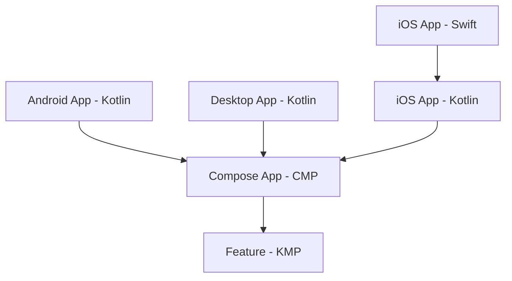

# Swinject + Koin: como injetar dependências Swift no Kotlin Multiplatform em projetos multi-módulo

O Kotlin Multiplatform (KMP) resolve um problema antigo do desenvolvimento mobile: compartilhar lógica de negócio entre Android, iOS e Desktop sem reescrever código. Mas existe um cenário que o KMP sozinho não resolve — quando a lógica compartilhada precisa consumir dependências que só existem no mundo nativo de cada plataforma.

Pense em configurações de criptografia de rede, acesso à Keychain, biometria ou qualquer SDK proprietário. No iOS, essas implementações vivem em Swift e muitas vezes já estão registradas em um container de injeção de dependências como o **Swinject**. No Android, o equivalente pode estar em Kotlin puro, gerenciado pelo Hilt, Dagger ou pelo próprio Koin.

Agora imagine um `UseCase` no código compartilhado que depende de duas dessas implementações nativas:

```kotlin
class ModuleUseCase(
    private val dependency1: Module1Dependency1,
    private val dependency2: Module1Dependency2
) {
    fun doSomething() {
        dependency1.doSomething()
        dependency2.doSomething()
    }
}
```

Esse `ModuleUseCase` vive no `commonMain` — código 100% compartilhado. Ele não sabe e nem deve saber se está rodando no iOS, Android ou Desktop. Mas `Module1Dependency1` e `Module1Dependency2` são interfaces cujas implementações concretas vêm de cada plataforma. No iOS, podem ser classes Swift registradas no Swinject. No Android, classes Kotlin gerenciadas pelo Hilt.

Como fazer essas instâncias nativas chegarem até aqui (no KMP)?

### Direção da dependência

A resposta curta é: **o código compartilhado não consegue enxergar o código nativo — e nem deveria**. A razão é arquitetural.

Em qualquer projeto KMP, a dependência flui do app nativo para as bibliotecas compartilhadas, nunca o contrário:



No iOS, o app em Swift importa o framework Kotlin (iOS App - Kotlin no diagrama), que depende do Compose App e do módulo de feature. E os módulos compartilhados estão na base da cadeia — sem referência a nenhum código de aplicação.

Inverter essa seta criaria uma dependência circular. Isso significa que um feature module KMP **nunca** vai referenciar uma classe que vive no app Swift ou no app Android. Ele simplesmente não sabe que elas existem.

### A implementação: dependências nativas

As dependências nativas são aquelas que o código compartilhado precisa consumir, mas cujas implementações só fazem sentido no mundo de cada plataforma. No exemplo, temos duas: `NativePlatformDependency1` e `NativePlatformDependency2`.

#### Interfaces no `commonMain`

As interfaces são definidas no módulo compartilhado (`module1`), dentro do pacote `dependencies`:

```kotlin
// NativePlatformDependency1.kt
interface NativePlatformDependency1 {
    fun doSomething(): String
}

// NativePlatformDependency2.kt
interface NativePlatformDependency2 {
    fun doSomething(): String
}
```

O código KMP conhece apenas o contrato. Não sabe — e não precisa saber — qual é a implementação concreta em cada plataforma.

#### Implementação no Android

No Android, as implementações vivem no app Kotlin e implementam as interfaces do módulo compartilhado:

```kotlin
class Dependency1 : NativePlatformDependency1 {
    override fun doSomething(): String {
        return "[Android] Module1 Dependency1"
    }
}

class Dependency2 : NativePlatformDependency2 {
    override fun doSomething(): String {
        return "[Android] Module1 Dependency2"
    }
}
```

#### Implementação no iOS (Swift)

No iOS, as implementações são classes Swift que importam o framework Kotlin e implementam as interfaces expostas por ele:

```swift
import IOSApp

class iOSDependency1: NativePlatformDependency1 {
    func doSomething() -> String {
        return "[iOS] Module1 Dependency1"
    }
}

class iOSDependency2: NativePlatformDependency2 {
    func doSomething() -> String {
        return "[iOS] Module1 Dependency2"
    }
}
```

#### Implementação no Desktop (JVM)

No Desktop, o mesmo padrão: classes Kotlin no app JVM implementam as interfaces:

```kotlin
class Dependency1 : NativePlatformDependency1 {
    override fun doSomething(): String {
        return "[JVM] Module1 Dependency1"
    }
}

class Dependency2 : NativePlatformDependency2 {
    override fun doSomething(): String {
        return "[JVM] Module1 Dependency2"
    }
}
```

Em cada plataforma, o contrato é o mesmo — só o comportamento muda. O `ModuleUseCase` no `commonMain` recebe essas dependências via injeção e chama `doSomething()` sem saber se está em Android, iOS ou Desktop.


#### UseCase: onde as dependências são consumidas

O `ModuleUseCase` vive no `commonMain` e recebe as duas dependências via construtor. É aqui que elas são efetivamente usadas:

```kotlin
@Factory
class ModuleUseCase(
    private val dependency1: NativePlatformDependency1,
    private val dependency2: NativePlatformDependency2,
) {
    fun doSomething1(): String {
        return dependency1.doSomething()
    }

    fun doSomething2(): String {
        return dependency2.doSomething()
    }
}
```

O UseCase não sabe se está rodando no Android, iOS ou Desktop — ele apenas chama os métodos das interfaces. Quem fornece as instâncias concretas é a plataforma, através do mecanismo que veremos na próxima seção.

#### Composable: onde o UseCase é usado

O `ModuleUseCase` é resolvido pelo Koin e consumido na função `App()`, o Composable raiz da UI compartilhada:

```kotlin
@Composable
@Preview
fun App() {
    startKoin<AppModule>()
    val useCase = KoinPlatform.getKoin().get<ModuleUseCase>()

    MaterialTheme {
        Box(contentAlignment = Alignment.Center, modifier = Modifier.fillMaxSize()) {
            Column(horizontalAlignment = Alignment.CenterHorizontally) {
                Text("Teste KOIN + SWINJECT")
                Text(useCase.doSomething1())
                Text(useCase.doSomething2())
            }
        }
    }
}
```

A cadeia está completa: o Composable obtém o UseCase do Koin, o UseCase recebe as dependências nativas injetadas, e o resultado de cada plataforma aparece na tela.


### A solução

A resposta está no uso do **Koin** combinado com um **Provider Pattern** e a **inicialização isolada de cada módulo**. O fluxo tem três peças: o provider, o `startModule` e o módulo Koin.

#### O Provider: ponte entre nativo e KMP

O `Module1DependencyProvider` é uma interface Kotlin definida no módulo compartilhado. Cada plataforma implementa essa interface e delega para suas próprias instâncias:

```kotlin
interface Module1DependencyProvider {
    fun provideDependency1(): NativePlatformDependency1
    fun provideDependency2(): NativePlatformDependency2
}
```

- **Android / Desktop**: a implementação é Kotlin puro e retorna as classes locais (`AndroidProvider`, `JVMProvider`).
- **iOS**: a implementação é Swift e delega ao container Swinject — `iOSProviderImpl` resolve as dependências do container antes de retorná-las ao KMP.

#### Swinject no iOS: DependencyInjector e iOSProviderImpl

No iOS, o **Swinject** é o container de DI nativo. Ele gerencia o ciclo de vida das implementações Swift (`iOSDependency1`, `iOSDependency2`) e permite que outras partes do app Swift também as consumam. O `DependencyInjector` configura o container:

```swift
enum DependencyInjector {
    static func createContainer() -> Container {
        let container = Container()

        container.register(NativePlatformDependency1.self) { _ in
            iOSDependency1()
        }

        container.register(NativePlatformDependency2.self) { _ in
            iOSDependency2()
        }

        return container
    }
}
```

As interfaces (`NativePlatformDependency1`, `NativePlatformDependency2`) vêm do framework Kotlin — o Swinject as conhece porque o framework as expõe. O closure de cada `register` instancia a classe Swift correspondente.

O `iOSProviderImpl` implementa a interface Kotlin `Module1DependencyProvider` e usa o container para resolver as dependências quando o Koin pedir:

```swift
class iOSProviderImpl: Module1DependencyProvider {
    private let container: Container

    init(container: Container) {
        self.container = container
    }

    func provideDependency1() -> NativePlatformDependency1 {
        return container.resolve(NativePlatformDependency1.self)!
    }

    func provideDependency2() -> NativePlatformDependency2 {
        return container.resolve(NativePlatformDependency2.self)!
    }
}
```

Assim, o Swinject continua sendo a fonte de verdade no iOS. O Koin não substitui o Swinject — ele apenas recebe as instâncias via provider quando precisa resolver o `ModuleUseCase`.

#### O Wrapper e o `startModule1`

O módulo compartilhado não pode receber o provider no construtor — ele não conhece o app. A solução é um wrapper singleton que armazena a referência:

```kotlin
internal object Module1DependencyProviderWrapper {
    lateinit var provider: Module1DependencyProvider
}

fun startModule1(provider: Module1DependencyProvider) {
    Module1DependencyProviderWrapper.provider = provider
}
```

O app nativo chama `startModule1(provider)` **antes** de inicializar o Koin e exibir a UI. Assim, quando o Koin resolver as dependências, o provider já está configurado.

#### KoinModule1: expondo dependências nativas no grafo

O `KoinModule1` vive no módulo compartilhado e faz a ponte entre o provider (configurado pela plataforma) e o grafo do Koin. Ele declara três factories:

```kotlin
@Module
@ComponentScan("com.example.module1")
class KoinModule1 {

    @Factory
    fun moduleProvider(): Module1DependencyProvider =
        Module1DependencyProviderWrapper.provider

    @Factory
    fun provideDependency1(provider: Module1DependencyProvider): NativePlatformDependency1 =
        provider.provideDependency1()

    @Factory
    fun provideDependency2(provider: Module1DependencyProvider): NativePlatformDependency2 =
        provider.provideDependency2()
}
```

- **`moduleProvider()`** — Retorna o provider armazenado no wrapper. O Koin usa isso sempre que precisar de um `Module1DependencyProvider` (por exemplo, para injetar em `provideDependency1` e `provideDependency2`).

- **`provideDependency1(provider)`** e **`provideDependency2(provider)`** — O Koin injeta o provider automaticamente e cada factory delega a chamada ao provider, que retorna a instância nativa (Android, iOS ou Desktop).

O `@ComponentScan("com.example.module1")` faz o Koin escanear o pacote do módulo em busca de classes anotadas com `@Factory` ou `@Singleton`. É assim que o `ModuleUseCase` — que tem `@Factory` e depende de `NativePlatformDependency1` e `NativePlatformDependency2` — entra no grafo. Quando o Koin resolve o `ModuleUseCase`, ele encontra as dependências já registradas por `provideDependency1` e `provideDependency2`.

#### AppModule: a raiz do grafo Koin

O `AppModule` é a classe passada para `startKoin<AppModule>()` no Composable `App()`. Ela define a raiz do grafo de dependências:

```kotlin
@KoinApplication(modules = [KoinModule1::class])
@ComponentScan("com.example.mykoincmpapplication")
class AppModule
```

- **`@KoinApplication`** — Marca a classe como ponto de entrada do Koin. O plugin de compilação gera o código que inicializa o container.

- **`modules = [KoinModule1::class]`** — Inclui o `KoinModule1` (e qualquer outro módulo de feature) no grafo. Cada feature module com dependências nativas terá seu próprio `KoinModuleX` aqui.

- **`@ComponentScan("com.example.mykoincmpapplication")`** — Escaneia o pacote do `composeApp` em busca de componentes. Neste exemplo, não há factories nesse pacote, mas em projetos maiores podem existir ViewModels ou outros serviços compartilhados.

O `AppModule` não conhece Android, iOS ou Swift — ele apenas declara quais módulos compõem o grafo. As instâncias concretas das dependências nativas chegam via provider, configurado antes do `startKoin`.

#### O `startKoin`: inicializando o container

O `startKoin<AppModule>()` é a chamada que sobe o container do Koin. Ele usa o plugin **Koin Annotations** (compiler plugin), que gera em tempo de compilação o código que registra todos os módulos e componentes declarados no `AppModule`.

```kotlin
@Composable
fun App() {
    startKoin<AppModule>()
    val useCase = KoinPlatform.getKoin().get<ModuleUseCase>()
    // ...
}
```

- **Onde é chamado** — Dentro do Composable `App()`, como primeira linha. O `App()` é o ponto de entrada da UI compartilhada em todas as plataformas (Android, iOS, Desktop), então o Koin é inicializado no mesmo lugar em todo o projeto.

- **O que acontece** — O plugin gera uma função que instancia o `KoinApplication` a partir do `AppModule`, carrega os módulos (`KoinModule1`, etc.), executa os `@ComponentScan` e monta o grafo. Após o `startKoin`, qualquer `get<T>()` ou injeção de construtor passa a funcionar.

- **Por que depois do `startModule1`** — O `startKoin` não recebe o provider como parâmetro. O provider já precisa estar no wrapper quando o Koin montar o grafo e resolver `provideDependency1` e `provideDependency2`. Por isso a ordem é obrigatória: primeiro `startModule1(provider)` na plataforma, depois `startKoin<AppModule>()` no `App()`.

- **Idempotência** — O Koin trata múltiplas chamadas a `startKoin` de forma segura: se o container já estiver inicializado, chamadas subsequentes não recriam o grafo. Isso é relevante em Compose, onde o `App()` pode ser recomposado.

#### Onde cada plataforma chama `startModule1`

**Android** — no `onCreate` da `MainActivity`, antes do `setContent`:

```kotlin
override fun onCreate(savedInstanceState: Bundle?) {
    startModule1(AndroidProvider())
    setContent { App() }
}
```

**Desktop** — no `main()`, antes de abrir a janela:

```kotlin
fun main() {
    startModule1(JVMProvider())
    application { ... }
}
```

**iOS** — no `init` do app Swift, configurando o Swinject e passando o provider:

```swift
init() {
    let container = DependencyInjector.createContainer()
    Module1ContractKt.startModule1(provider: iOSProviderImpl(container: container))
}
```

A ordem é crítica: `startModule1` → `startKoin` → `App()`. O provider precisa estar registrado antes de qualquer resolução do Koin.

---

### Desafios em apps multi-módulo

Em projetos com vários feature modules, cada um com dependências nativas, o padrão se repete — mas surgem desafios adicionais.

**Ordem de inicialização.** Cada módulo expõe seu próprio `startModuleX`. O app precisa chamar todos, na ordem correta, antes do `startKoin`. Se o `module2` depender do `module1`, o `startModule1` deve ser chamado primeiro. Documentar essa ordem e garantir que novos módulos sejam inicializados no ponto de entrada de cada plataforma evita erros em runtime.

**Provider por plataforma.** Cada app (Android, iOS, Desktop) precisa implementar um provider para cada módulo que tenha dependências nativas. No iOS, isso significa uma classe Swift por módulo que delega ao Swinject. A duplicação de boilerplate é inevitável, mas o contrato (a interface) permanece no KMP.

**Acoplamento ao ciclo de vida do app.** O provider é configurado no startup do app. Se uma dependência nativa precisar ser recriada ou reinicializada (por exemplo, após logout), o wrapper armazena uma referência que pode ficar obsoleta. Nesses cenários, pode ser necessário expor um `restartModule` ou permitir que o provider seja trocado em runtime — com cuidado para não quebrar instâncias já resolvidas pelo Koin.

**Testes.** O wrapper com `lateinit var` dificulta testes unitários isolados: o estado é global. Uma alternativa é injetar o provider no módulo Koin via parâmetro (quando o Koin suportar), ou usar um `TestProvider` que retorna mocks e garantir que os testes configurem o wrapper antes de cada execução.

---

Este artigo mostrou como combinar Swinject, Koin e o Provider Pattern para injetar dependências nativas no código KMP, mesmo com a barreira de dependência entre app e lib. O padrão escala para múltiplos módulos, desde que a ordem de inicialização e os trade-offs acima sejam considerados.
