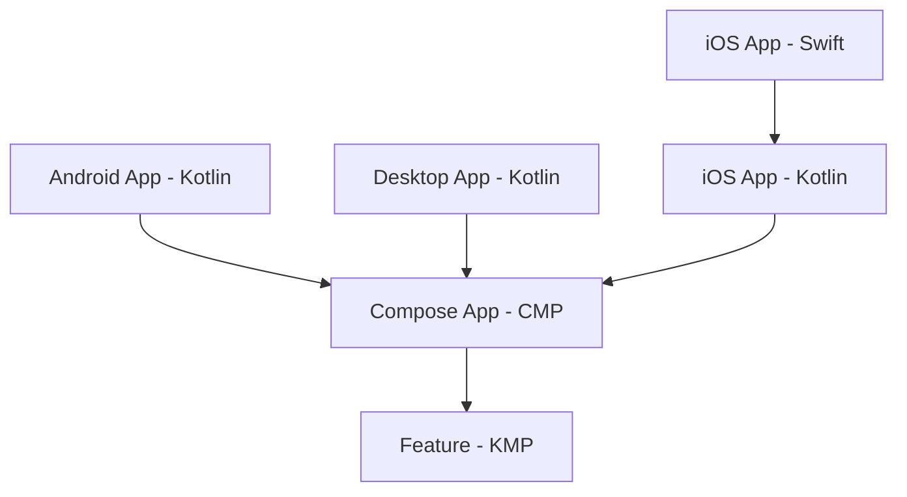

# Swinject + Koin: como injetar dependências Swift no Kotlin Multiplatform em projetos multi-módulo

O Kotlin Multiplatform (KMP) permite compartilhar lógica de negócio entre Android, iOS e Desktop. Porém, quando essa lógica precisa consumir dependências que só existem no mundo nativo de cada plataforma — criptografia de rede, Keychain, biometria, SDKs proprietários — o cenário fica mais complexo.

No iOS, essas implementações vivem em Swift e costumam estar em um container de DI como o **Swinject**. No Android, o equivalente pode estar em Kotlin, gerenciado pelo Hilt ou Koin. A pergunta é: como fazer um `UseCase` no `commonMain` receber essas instâncias nativas?

```kotlin
@Factory
class ModuleUseCase(
    private val dependency1: NativePlatformDependency1,
    private val dependency2: NativePlatformDependency2,
) {
    fun doSomething1(): String = dependency1.doSomething()
    fun doSomething2(): String = dependency2.doSomething()
}
```

O UseCase vive no código compartilhado e depende de duas interfaces. As implementações concretas vêm de cada plataforma. O desafio é fazer essas instâncias chegarem até aqui.

---

## Por que não é trivial: direção da dependência

O código compartilhado **não consegue enxergar o código nativo** — e nem deveria. A razão é arquitetural.

Em qualquer projeto KMP, a dependência flui do app para as bibliotecas compartilhadas, nunca o contrário:



O app iOS (Swift) importa o framework Kotlin. O framework depende do Compose App e do módulo de feature. Os módulos compartilhados estão na base da cadeia — sem referência a nenhum código de aplicação. Inverter essa seta criaria uma dependência circular. Um feature module KMP **nunca** vai referenciar classes que vivem no app.

---

## Visão geral da solução

A resposta combina **Provider Pattern** e **Koin**, com inicialização isolada por módulo. O fluxo em três passos:

1. **Na plataforma** — O app chama `startModule1(provider)` antes de exibir a UI. O provider implementa uma interface Kotlin e retorna as instâncias nativas (no iOS, delega ao Swinject).
2. **No KMP** — O `startKoin<AppModule>()` inicializa o container. O módulo Koin usa o provider (armazenado em um wrapper) para registrar as dependências nativas no grafo.
3. **No Composable** — O `App()` obtém o `ModuleUseCase` via `get<>()`. O Koin resolve as dependências e injeta as instâncias nativas.

A ordem é crítica: `startModule1` → `startKoin` → `App()`.

---

## Implementação

### 1. Interfaces no `commonMain`

As interfaces são definidas no módulo compartilhado. O KMP conhece apenas o contrato:

```kotlin
interface NativePlatformDependency1 {
    fun doSomething(): String
}

interface NativePlatformDependency2 {
    fun doSomething(): String
}
```

### 2. Implementações por plataforma

Cada app implementa as interfaces com suas próprias classes. No Android e no Desktop, são classes Kotlin. No iOS, são classes Swift que importam o framework Kotlin:

```kotlin
// Android / Desktop
class Dependency1 : NativePlatformDependency1 {
    override fun doSomething(): String = "[Android] Module1 Dependency1"
}
```

```swift
// iOS
import IOSApp

class iOSDependency1: NativePlatformDependency1 {
    func doSomething() -> String {
        return "[iOS] Module1 Dependency1"
    }
}
```

### 3. O Provider: ponte entre nativo e KMP

O `Module1DependencyProvider` é uma interface que cada plataforma implementa. Ela retorna as instâncias das dependências nativas:

```kotlin
interface Module1DependencyProvider {
    fun provideDependency1(): NativePlatformDependency1
    fun provideDependency2(): NativePlatformDependency2
}
```

- **Android / Desktop** — A implementação é Kotlin puro e retorna as classes locais.
- **iOS** — A implementação é Swift e delega ao container Swinject (ver próximo tópico).

O provider é o **elo forte** entre o KMP e o nativo. Se alguém adicionar uma nova dependência no módulo compartilhado (por exemplo, `provideDependency3()`), a interface do provider muda. O código nativo — Android, iOS ou Desktop — passa a não compilar até que a nova dependência seja implementada. Esse é o objetivo: não queremos que o app quebre em **runtime** por conta de uma dependência que não foi declarada no Koin ou que o provider não entrega. O contrato explícito da interface garante que, em tempo de **build**, todas as plataformas estejam alinhadas.

### 4. Swinject no iOS

No iOS, o **Swinject** é o container de DI nativo. O `DependencyInjector` configura o container e registra as interfaces (expostas pelo framework Kotlin) com as implementações Swift:

```swift
enum DependencyInjector {
    static func createContainer() -> Container {
        let container = Container()
        container.register(NativePlatformDependency1.self) { _ in iOSDependency1() }
        container.register(NativePlatformDependency2.self) { _ in iOSDependency2() }
        return container
    }
}
```

O `iOSProviderImpl` implementa `Module1DependencyProvider` e usa o container para resolver as dependências quando o Koin pedir:

```swift
class iOSProviderImpl: Module1DependencyProvider {
    private let container: Container

    init(container: Container) { self.container = container }

    func provideDependency1() -> NativePlatformDependency1 {
        return container.resolve(NativePlatformDependency1.self)!
    }
    func provideDependency2() -> NativePlatformDependency2 {
        return container.resolve(NativePlatformDependency2.self)!
    }
}
```

O Swinject continua sendo a fonte de verdade no iOS. O Koin não o substitui — apenas recebe as instâncias via provider.

### 5. Wrapper e `startModule1`

O módulo compartilhado não conhece o app. Para receber o provider, usamos um wrapper singleton e uma função pública:

```kotlin
internal object Module1DependencyProviderWrapper {
    lateinit var provider: Module1DependencyProvider
}

fun startModule1(provider: Module1DependencyProvider) {
    Module1DependencyProviderWrapper.provider = provider
}
```

O app chama `startModule1(provider)` no ponto de entrada de cada plataforma, **antes** de exibir a UI:

```kotlin
// Android - MainActivity.onCreate
startModule1(AndroidProvider())
setContent { App() }

// Desktop - main()
startModule1(JVMProvider())
application { ... }
```

```swift
// iOS - init do app
init() {
    let container = DependencyInjector.createContainer()
    Module1ContractKt.startModule1(provider: iOSProviderImpl(container: container))
}
```

### 6. Koin: AppModule, KoinModule1 e `startKoin`

O `AppModule` é a raiz do grafo. Ela declara os módulos e é passada para `startKoin<AppModule>()`:

```kotlin
@KoinApplication(modules = [KoinModule1::class])
@ComponentScan("com.example.mykoincmpapplication")
class AppModule
```

O `KoinModule1` usa o provider do wrapper para expor as dependências nativas no grafo. O `@ComponentScan` faz o Koin encontrar o `ModuleUseCase` (anotado com `@Factory`):

```kotlin
@Module
@ComponentScan("com.example.module1")
class KoinModule1 {

    @Factory
    fun moduleProvider(): Module1DependencyProvider =
        Module1DependencyProviderWrapper.provider

    @Factory
    fun provideDependency1(provider: Module1DependencyProvider): NativePlatformDependency1 =
        provider.provideDependency1()

    @Factory
    fun provideDependency2(provider: Module1DependencyProvider): NativePlatformDependency2 =
        provider.provideDependency2()
}
```

O `startKoin<AppModule>()` sobe o container. Ele usa o plugin **Koin Annotations**, que gera em tempo de compilação o código que monta o grafo. É chamado dentro do Composable `App()`, como primeira linha — assim o Koin é inicializado no mesmo lugar em todas as plataformas. O Koin trata múltiplas chamadas de forma segura (idempotente), o que importa em Compose, onde o `App()` pode ser recomposado.

### 7. Cadeia completa: Composable → UseCase → dependências

O `App()` obtém o UseCase do Koin e exibe o resultado:

```kotlin
@Composable
fun App() {
    startKoin<AppModule>()
    val useCase = KoinPlatform.getKoin().get<ModuleUseCase>()

    MaterialTheme {
        Box(contentAlignment = Alignment.Center, modifier = Modifier.fillMaxSize()) {
            Column(horizontalAlignment = Alignment.CenterHorizontally) {
                Text("Teste KOIN + SWINJECT")
                Text(useCase.doSomething1())
                Text(useCase.doSomething2())
            }
        }
    }
}
```

Fluxo: o Composable chama `get<ModuleUseCase>()` → o Koin resolve o UseCase e injeta `NativePlatformDependency1` e `NativePlatformDependency2` → essas instâncias vêm do provider (Android, Swinject no iOS, ou JVM) → o resultado aparece na tela.

---

## Conclusão

O Provider Pattern com Koin permite injetar dependências nativas no código KMP sem violar a direção da dependência entre app e lib. O provider funciona como elo forte: qualquer mudança no contrato quebra o build nas plataformas que ainda não implementaram, evitando falhas em runtime. No iOS, o Swinject permanece como fonte de verdade — o Koin apenas consome as instâncias via provider, sem substituir o DI nativo.

O padrão escala para múltiplos módulos. A ordem de inicialização (`startModule1` → `startKoin` → `App()`) deve ser respeitada. Se você está adotando KMP em um app com DI nativo já estabelecido, vale experimentar essa abordagem antes de reescrever tudo em Kotlin.

